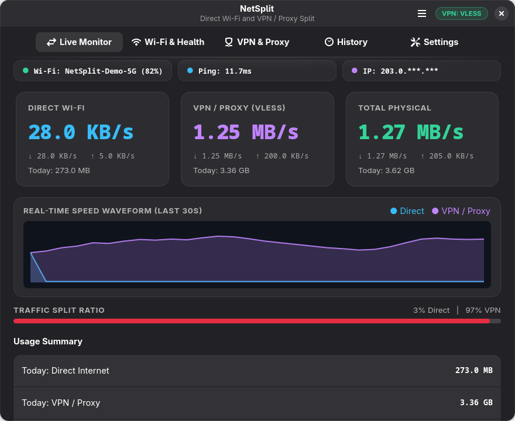
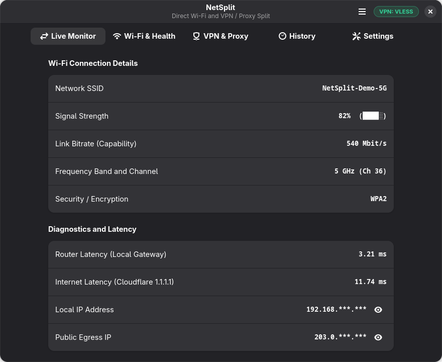
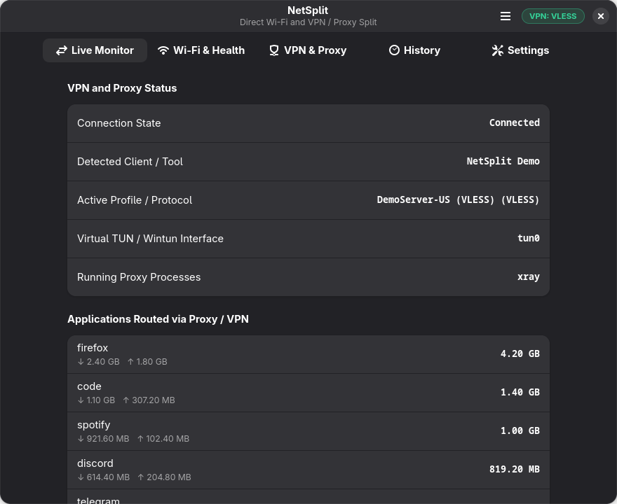
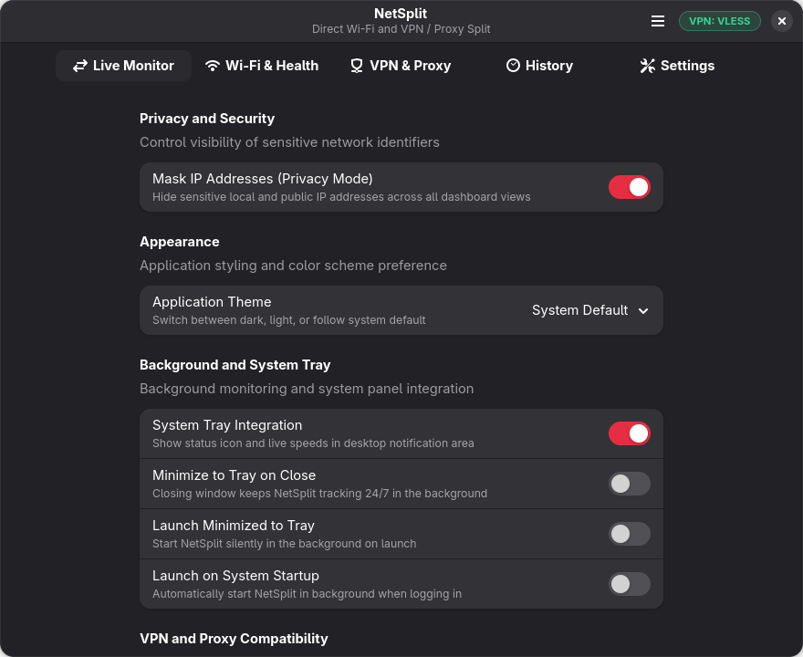

<div align="center">

  

  # NetSplit

  **Cross-Platform Real-Time Network & VPN / Proxy Traffic Split Monitor**

  [](https://github.com/ChavinduJayakody/NetSplit/releases)
  [](https://github.com/ChavinduJayakody/NetSplit/releases)
  [](LICENSE)
  [](https://www.python.org/)

  <p align="center">
    <b>NetSplit</b> accurately splits and accounts for <b>Direct Wi-Fi Internet</b> versus <b>VPN / Proxy tunnel data</b> in real time.<br/>
    Designed for metered connections, split-tunneling proxies, and privacy-conscious users.
  </p>

  <p align="center">
    <a href="#-downloads--installation"><b>Downloads</b></a> •
    <a href="#-screenshots"><b>Screenshots</b></a> •
    <a href="#-key-features"><b>Features</b></a> •
    <a href="#-quickstart-from-source"><b>Source Build</b></a> •
    <a href="#-supported-vpn--proxy-clients"><b>Supported Clients</b></a>
  </p>

</div>

---

## 📦 Downloads & Installation

Pre-compiled standalone binaries are automatically built and published with every release. No dependencies or Python installation required!

| Platform | Format | Download Link | Notes |
|:---|:---|:---|:---|
| **Linux (x86_64)** | **`.AppImage`** | [**Download Latest Linux AppImage**](https://github.com/ChavinduJayakody/NetSplit/releases/latest) | Universal — works on Ubuntu, Fedora, Debian, Mint, CachyOS. `chmod +x` and run. |
| **Arch Linux (x86_64)** | **`.pkg.tar.zst`** | [**Download Latest Arch Package**](https://github.com/ChavinduJayakody/NetSplit/releases/latest) | Native Arch/CachyOS/Manjaro package. Uses system GTK4 & Python. |
| **Windows (x64)** | **`.exe`** | [**Download Latest Windows Standalone (.exe)**](https://github.com/ChavinduJayakody/NetSplit/releases/latest) | Single-file executable. Runs directly using built-in Microsoft Edge WebView2. |

### Running the AppImage on Linux
```bash
chmod +x NetSplit-Linux-x86_64.AppImage
./NetSplit-Linux-x86_64.AppImage
```

### Installing the Arch Package
```bash
# Install with pacman directly
sudo pacman -U NetSplit-Linux-x86_64.pkg.tar.zst

# Then launch
netsplit
```

---

## 📸 Screenshots

<div align="center">

### 1. Live Traffic Monitor & Real-Time Waveform
*Real-time meters for Direct Wi-Fi, VPN / Proxy, and Total Physical traffic with live Cairo waveforms and split ratio meter.*
<br/><br/>


<br/><br/>

### 2. Wi-Fi Health & Latency Diagnostics
*Live Wi-Fi signal quality, link capability, frequency channel, router gateway ping, Internet ping, and masked IP identifiers.*
<br/><br/>


<br/><br/>

### 3. VPN & Proxy Multi-Protocol Detection
*Auto-detects active TUN adapters (`throne-tun`, `wintun`), running proxy processes (VLESS, Xray, Sing-Box, etc.), and per-app data breakdown.*
<br/><br/>


<br/><br/>

### 4. Native Preferences & Exclusive Mode Settings
*Toggle Exclusive Accounting Mode, customize IP masking, switch between Dark/Light/System theme, and control System Tray behavior.*
<br/><br/>


</div>

---

## ✨ Key Features

- **⚡ Exclusive Accounting Mode (Toggleable)**:
  - When VPN is active, Direct Wi-Fi reads **0 B/s** and all traffic counts as VPN.
  - Prevents double-counting when all device traffic is tunneled through a proxy or VPN.
  - Can be switched to concurrent split mode anytime in Settings.
- **🛡️ Multi-Protocol VPN & Proxy Auto-Detection**:
  - Automatically detects **Throne, NetMod, Netch, NekoRay, v2rayA, Clash, Sing-Box, Xray, WireGuard, and OpenVPN**.
  - Identifies active protocol types (VLESS, VMess, Trojan, Shadowsocks, WireGuard).
  - Inspects virtual TUN adapters (`throne-tun`, `wintun`, `tun0`) without requiring root/admin rights.
- **👁️ Privacy Mode & IP Masking**:
  - Automatically masks sensitive local (`192.168.1.***`) and public egress IPs across all screens.
  - Interactive one-click reveal/conceal buttons to inspect IPs securely on demand.
- **📈 Cairo Live Waveform Graph**:
  - Rolling 30-second Cairo-rendered waveform chart tracking live upload and download trends.
- **📡 In-Depth Wi-Fi Diagnostics**:
  - SSID, signal percentage with dynamic signal bars (`▂▄▆█`), bitrate capability (up to 1200+ Mbit/s), and frequency channel (2.4 GHz vs 5 GHz).
  - Dual ping monitoring: Local Gateway (router hop) and Internet DNS (Cloudflare 1.1.1.1).
- **💾 Local SQLite History**:
  - Tracks session bandwidth, hourly consumption, and 7-day daily history without relying on external cloud services.
- **🎛️ System Tray & Autostart**:
  - Native StatusNotifierItem (D-Bus) on Linux and Shell_NotifyIcon on Windows.
  - Minimize-to-tray on close, background monitoring 24/7, and startup launch toggle.
- **🎨 Modern Native GUI**:
  - Linux: Clean GNOME Libadwaita / GTK 4 interface matching system aesthetics.
  - Windows: High-performance WebView2 desktop window with system theme adaptation.

---

## 🛠️ Supported VPN & Proxy Clients

NetSplit automatically detects and monitors:

| Client / Core | Detection Method | Supported Protocols |
|:---|:---|:---|
| **Throne** | Virtual TUN (`throne-tun`) + SQLite stats DB | VLESS, VMess, Trojan, Shadowsocks, Hysteria |
| **NetMod (Syna)** | TUN device + core process | SSH, SSL, Shadowsocks, V2Ray |
| **Netch** | Wintun adapter + Netch process | Process Mode, TUN/TAP Mode, WireGuard |
| **NekoRay / Matsuri** | TUN mode + sing-box core | SOCKS5, Shadowsocks, VMess, VLESS |
| **v2rayA** | Virtual adapter + xray/v2ray-core | Transparent proxy, VLESS, VMess |
| **Clash / Clash Verge** | Tun mode + clash core | Mixed, Shadowsocks, VMess, Trojan |
| **Sing-Box** | Virtual TUN adapter | WireGuard, VLESS, Trojan, ShadowTLS |
| **Xray / V2Ray Core** | Tun interface + xray executable | VLESS, VMess, Trojan, Splithttp |
| **WireGuard** | `wg0` / Wintun adapter | Native WireGuard |
| **OpenVPN** | `tun0` / TAP-Windows adapter | OpenVPN UDP/TCP |

*(You can also set a **Custom Interface Override** in Settings for specialized network adapters).*

---

## 🚀 Quickstart from Source

### Linux (Ubuntu / Debian / Arch / Fedora)

```bash
# Clone the repository
git clone https://github.com/ChavinduJayakody/NetSplit.git
cd NetSplit

# Run directly via the automated launcher
./run.sh
```

Or manually:
```bash
# Create virtual environment with system site-packages (for GTK4/Adwaita)
python3 -m venv --system-site-packages venv
source venv/bin/activate
pip install -r requirements.txt

# Launch native GTK 4 / Libadwaita application
python3 main.py
```

### Windows (10 / 11)

```cmd
:: Clone repository
git clone https://github.com/ChavinduJayakody/NetSplit.git
cd NetSplit

:: Run launcher (auto-configures environment and dependencies)
run.bat
```

---

## 💻 CLI & Alternative Modes

NetSplit provides multiple runtime modes:

```text
python3 main.py [OPTIONS]

Options:
  --gnome        Launch native GNOME GTK4/Libadwaita application (Default on Linux)
  --desktop      Launch native Desktop App window (Default on Windows)
  --web          Launch headless web dashboard server only (View at http://localhost:8765)
  --cli          Launch real-time curses terminal monitor (TUI)
  --minimized    Start minimized directly into system tray
  --host HOST    Host address to bind to (Default: 127.0.0.1)
  --port PORT    Port for web server (Default: 8765)
```

---

## 🔨 Building Binaries Locally

### Build Linux AppImage
```bash
./scripts/build_appimage.sh
# Output binary: dist/NetSplit-Linux-x86_64.AppImage
```

### Build Windows Standalone Executable
```cmd
scripts\build_exe.bat
:: Output binary: dist\NetSplit.exe
```

---

## 🤖 CI/CD Automation

NetSplit uses **GitHub Actions** (`.github/workflows/release.yml`) for automated builds:
- Triggers on every release tag push (`git tag v1.4.0 && git push origin v1.4.0`) or manual workflow dispatch.
- Compiles both `NetSplit-Windows-x64.exe` and `NetSplit-Linux-x86_64.AppImage`.
- Generates `SHA256SUMS.txt` cryptographic verification checksums.
- Automatically attaches all assets to the official GitHub Release.

---

## 📄 License

This project is licensed under the **MIT License** - see the [LICENSE](LICENSE) file for details.
